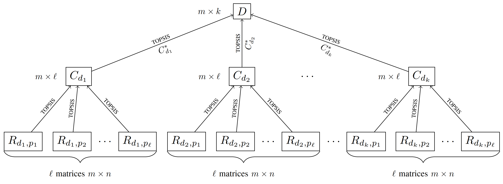

# HRA
 Hierarchical Rank Aggregation (HRA) algorithm for ranking meta-heuristic optimization algorithms

The Hierarchical Rank Aggregation Algorithm (HRA) aims to efficiently rank meta-heuristic algorithms based on their performance across many criteria and dimensions.

The HRA employs a hierarchical framework that begins with collecting performance metrics on various benchmark functions and dimensions. The normalized ranking technique is used to rank each performance measure, which guarantees comparability and R-TOPSIS robustness that aggregates these rankings at several hierarchical levels, resulting in a thorough ranking of the algorithms. 
The Matlab script employs data from the CEC'2017 competition to demonstrate the robustness and efficacy of the HRA framework. It examines 30 benchmark functions and evaluates the performance of 13 meta-heuristic algorithms across five performance indicators in four distinct dimensions. 
